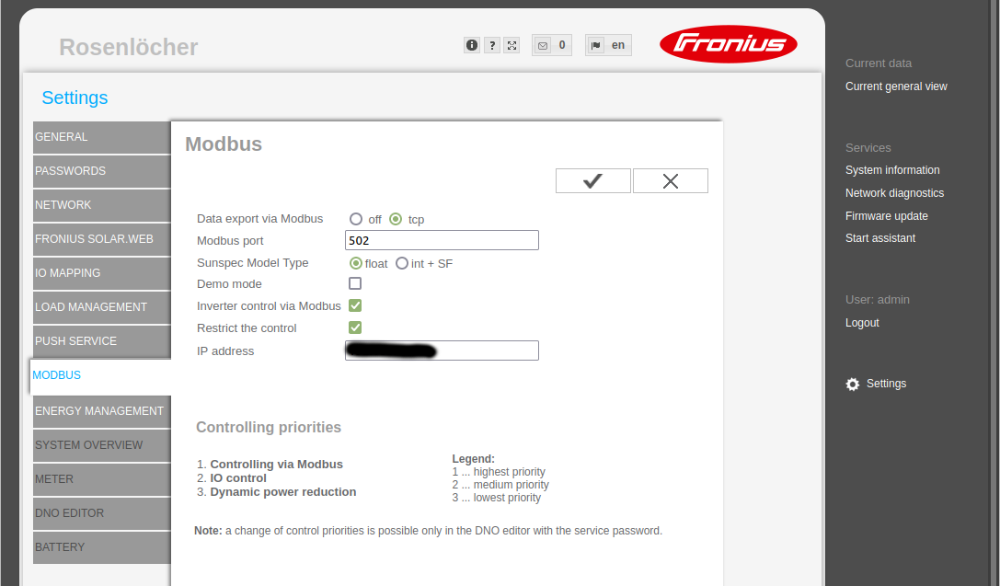

# fronius-mqtt-bridge

Reads out a Fronius Symo Hybrid Inverter via Modbus and publishes the data via MQTT.

There are 3 channels with different timing behavior.

### Topic "quick" - default 10 seconds

```python
{
  "invAcPower": 1375.0,                     # current inverter AC power in W (positive values: outcoming from inverter)
  "invDcPower": 1393.8000488,               # current inverter DC power in W (positive values: incoming into inverter)
  "invEfficiency": 98.651166,               # inverter efficiency ("invDcPower" / "invAcPower") in %
  "metAcPower": -1178.3900146,              # current meter AC power in W (your endpoint: importing: + / exporting: -)
  "mpptBatPower": 0.0,                      # current battery power in W (negative values means charging)
  "mpptModPower": 1393.8,                   # current modules power in W (module string)
  "mpptModVoltage": 520.1,                  # current modules voltage in V (module string)
  "selfConsumption": -0.19661,              # current own consumption in W ("invAcPower" - "metAcPower")
  "status": "ok",                           # message status
  "timestamp": "2022-05-03T17:28:40+02:00"  # message creating time
}
```

### Topic "medium" - default 60 seconds
```python
{
  "eflowInvAcOut": 24.1058917,              # exported AC energy by inverter in Wh # see "eflow!"
  "eflowInvDcOut": 24.414075,               # imported DC energy by inverter: accumulated since last message in Wh
  "eflowModOut": 24.4241958,                # modules energy accumulated since last message in Wh
  "invAcEnergyTot": 23494744.0,             # absolute energy exported by inverter
  "invStateCode": 4,                        # see docu: Fronius Operating Codes
  "invStateText": "(4) NORMAL",             # check documentation
  "metEnergyExpTot": 13908758.0,            # absolute energy exported by this inverter in Wh (your endpoint == meter)
  "metEnergyImpTot": 3297517.0,             # absolute energy imported by this inverter in Wh (your endpoint == meter)
  "metFrequency": 50.0,                     # electric grid frequency in Hz
  "mpptBatStateCode": 4,                    # battery (string) status
  "mpptBatStateText": "(4) NORMAL",
  "mpptModStateCode": 4,                    # module string status
  "mpptModStateText": "(4) NORMAL",
  "status": "ok",                           # message status
  "timestamp": "2022-05-03T17:28:30+02:00"  # message creating time
}
```
**"eflow!"** means accumulated energy since the last message. So all value may be summed up over a specific time period. 
This is not very accurate, as it just measures and accumulates every 10 seconds without regard of real variations (sampling theorem)!

### Topic "slow" - default 300 seconds
```python
{
  "batFillLevel": 99.0,                     # battery fill status in %
  "batStateCode": 5,
  "batStateText": "(5) FULL",
  "status": "ok",                           # message status
  "timestamp": "2022-05-03T17:27:30+02:00"  # message creating time
}
```

## Disclaimer

- Only tested with a "Fronius Symo Hybrid 4.0-3-S" (only 1 module string)
- Therefore, only one module string is supported.
- Check the Fronius inverter/Modbus docu for a basic understanding: [Local version](./docs/Fronius_Datamanager_Modbus_TCP-RTU_20200923.pdf)
- Only Linux systems supported. (Supposed to run as Linux service.)

## Startup

### Prepare your inverter

Make sure Modbus is enabled. Use **"float"** as "Sun Spec Model Type". 



### Python prerequisites

Python 3 ...

```bash
sudo apt-get install python3-dev python3-pip python3-venv python3-wheel -y
```

### Prepare python environment

```bash
cd /opt
sudo mkdir fronius-mqtt-bridge
sudo chown <user>:<user> fronius-mqtt-bridge  # type in your user
git clone https://github.com/rosenloecher-it/fronius-mqtt-bridge fronius-mqtt-bridge

cd fronius-mqtt-bridge
python3 -m venv venv

# activate venv
source ./venv/bin/activate

# check python version >= 3.7
python --version

# install required packages
pip install -r requirements.txt
# or: pip install -r requirements-dev.txt
```

### Configuration

```bash
# cd ... goto project dir
cp ./fronius-mqtt-bridge.yaml.sample ./fronius-mqtt-bridge.yaml

# security concerns: make sure, no one can read the stored passwords
chmod 600 ./fronius-mqtt-bridge.yaml
```

Edit your `fronius-mqtt-bridge.yaml`. See comments there.

### Run

```bash
# see command line options
./fronius-mqtt-bridge.sh --help

# prepare your own config file based on ./fronius-mqtt-bridge.yaml.sample
# the embedded json schema may contain additional information
./fronius-mqtt-bridge.sh --json-schema

# start the logger
./fronius-mqtt-bridge.sh --print-logs --config-file ./fronius-mqtt-bridge.yaml
# abort with ctrl+c

```

## Register as systemd service
```bash
# prepare your own service script based on fronius-mqtt-bridge.service.sample
cp ./fronius-mqtt-bridge.service.sample ./fronius-mqtt-bridge.service

# edit/adapt pathes and user in fronius-mqtt-bridge.service
vi ./fronius-mqtt-bridge.service

# install service
sudo cp ./fronius-mqtt-bridge.service /etc/systemd/system/
# alternativ: sudo cp ./fronius-mqtt-bridge.service.sample /etc/systemd/system//fronius-mqtt-bridge.service
# after changes
sudo systemctl daemon-reload

# start service
sudo systemctl start fronius-mqtt-bridge

# check logs
journalctl -u fronius-mqtt-bridge
journalctl -u fronius-mqtt-bridge --no-pager --since "5 minutes ago"

# enable autostart at boot time
sudo systemctl enable fronius-mqtt-bridge.service
```

## Additional infos

### MQTT broker related infos

I use an 

If no messages get logged check your broker.
```bash
sudo apt-get install mosquitto-clients

# prepare credentials
SERVER="<your server>"

# start listener
mosquitto_sub -h $SERVER -d -t smarthome/#

# send single message
mosquitto_pub -h $SERVER -d -t smarthome/test -m "test_$(date)"

# just as info: clear retained messages
mosquitto_pub -h $SERVER -d -t smarthome/test -n -r -d
```

## Maintainer & License

MIT © [Raul Rosenlöcher](https://github.com/rosenloecher-it)

The code is available at [GitHub][home].

[home]: https://github.com/rosenloecher-it/fronius-mqtt-bridge
